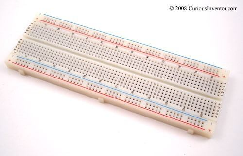
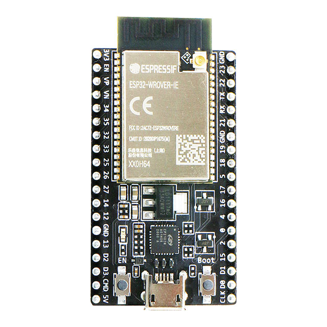
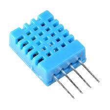
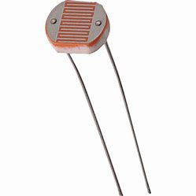
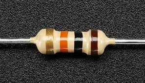
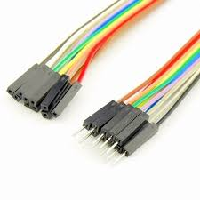
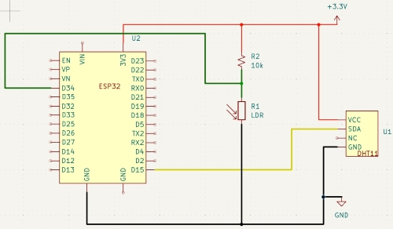
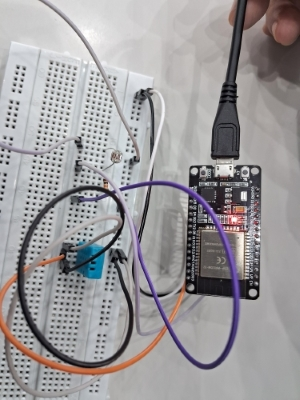

# Monitoramento de Temperatura, Umidade e Luminosidade 
</div>

O projeto permite o monitoramento de temperatura, umidade e luminosidade de um ambiente, utilizando um ESP32, comunicação MQTT para envio de dados em tempo real e armazenamento de dados no MongoDB e SQL. Este repositório contém o código necessário para conectar-se a uma rede Wi-Fi e enviar dados para um Broker MQTT, bem como receber comandos para ligar e desligar um LED quando alguns dos parâmetros se encontra fora do intervalo ideal.  Os dados são inicialmente recebidos pelo MongoDB, depois enviados e armazenados no SQL. <br>
Além disso, implementa um painel para visualização de dados de luminosidade, temperatura e umidade coletados por um ESP32. Utiliza o Dash para criar uma interface web que exibe gráficos em tempo real, com dados obtidos de uma API e exibidos através de gráficos de linha, barras e pizza. 
O projeto trabalha com as seguintes variáveis em seus respectivos intervalor e triggers:
| Variável               | Intervalo  | Trigger (%) | Precisão do componente        |
|------------------------|------------|-------------|-------------------------------|
| Luz (LDR)              | 0 a 100%   | 0,1 a 30    | 12 bits de resolução          |
| Umidade (DHT11)        | 0 a 100%   | 30 a 50     | ±5% RH                        |
| Temperatura (DHT11)    | 0 a 50ºC   | 15 a 25     | ±2°C                          |

## Hardware
### Componentes
| Componente               | Função                                                                 | Imagens                                            |
|--------------------------|------------------------------------------------------------------------|----------------------------------------------------|
| Placa de prototipação     | Um equipamento usado para montar circuitos eletrônicos temporários sem a necessidade de solda, facilitando a experimentação. | <div align="center"></div> |
| ESP32                    | Responsável pela conectividade e comunicação com a plataforma FIWARE, o ESP32 opera em uma faixa de tensão de 0V a 3,3V e permite a transmissão de dados em tempo real. Amplamente utilizado em projetos de Internet das Coisas (IoT) devido sua conectividade Wi-Fi e Bluetooth integrada. Possui um LED onboard. | <div align="center"></div> |
| DHT11                    | Sensor digital que mede a temperatura e a umidade do ambiente. | <div align="center"></div> |
| LDR                      | Sensor digital que mede a luminosidade do ambiente.  | <div align="center"></div> |
| Resistor de 10KΩ          | Os resistores possuem o papel de proteger os componentes de possíveis excessos de corrente e dividir a tensão do circuito, de modo que, fossem criadas leituras precisas de sinais analógicos. | <div align="center"></div> |
| Jumpers                  | Conectar fisicamente os componentes.                                  | <div align="center"></div> |
| Aparelho de acesso à internet | 
	
### Conexões
| Componente  | Conexão                                                     |
|-------------|-------------------------------------------------------------|
| DHT11       | Pino de dados (DHT11) - Pino 15 (ESP32) <br> VCC (DHT11) <br>  GND (DHT11)|
| LDR         | Pino de saída (LDR) – Pino 34 (ESP32)                       |

### Diagrama Elétrico
Obtido através do Wokwi, a plataforma oferece uma interface visual para adicionar componentes, conectar fios e escrever código, além de fornecer suporte a bibliotecas populares e a uma grande variedade de sensores e dispositivos.

| <div align="center"></div> |

### Projeto Físico
| <div align="center" width="300px"></div> |

## Software
### FIWARE
O FIWARE é uma plataforma aberta que oferece ferramentas e APIs para desenvolver soluções inteligentes, facilitando a interoperabilidade entre sistemas, dispositivos IoT e aplicações. Seu principal componente, o Orion Context Broker, gerencia dados contextuais em tempo real, permitindo que dispositivos compartilhem informações, neste caso, temperatura, umidade e luminosidade, promovendo decisões automatizadas. A implantação dos componentes, conhecidos como Generic Enablers, é feita com Docker, o que facilita a escalabilidade e a portabilidade dos módulos. APIs RESTful garantem a comunicação entre os sistemas, enquanto o broker MQTT integra dados do ESP32 à plataforma FIWARE para processamento e análise em tempo real. 
#### Diagrama (arquitetura em camadas) de aplicação 
 
### Dependências
Este projeto requer as seguintes bibliotecas para funcionar:<br>
•	WiFi.h: Biblioteca para conectar o ESP32 à rede Wi-Fi.<br>
•	PubSubClient.h: Biblioteca para habilitar a comunicação MQTT com o Broker.<br>
•	DHT.h: Biblioteca para o sensor de temperatura e umidade DHT11.<br>
``` phyton
#include <WiFi.h>
#include <PubSubClient.h>
#include <DHT.h>
```
Certifique-se de instalar essas bibliotecas antes de carregar o código. Para instalar essas bibliotecas, abra o Arduino IDE e acesse **Sketch > Incluir Biblioteca > Gerenciar Bibliotecas.... ** Pesquise e instale as bibliotecas.
### Variáveis Configuráveis
No código, atualize os seguintes parâmetros conforme necessário:<br>
•	default_SSID: Nome da rede Wi-Fi<br>
•	default_PASSWORD: Senha da rede Wi-Fi<br>
•	default_BROKER_MQTT: IP do Broker MQTT<br>
•	default_TOPICO_SUBSCRIBE: Tópico de escuta para receber comandos do Broker<br>
•	default_TOPICO_PUBLISH_*: Tópicos de publicação para envio de informações de luminosidade, temperatura e umidade<br>
•	default_ID_MQTT: Identifica de forma única um cliente conectado a um Broker MQTT (servidor MQTT)<br>
```phyton
const char* default_SSID = "HORIZON"; // Nome da rede Wi-Fi
const char* default_PASSWORD = "1234567890"; // Senha da rede Wi-Fi
const char* default_BROKER_MQTT = "4.228.64.5"; // IP do Broker MQTT
const int default_BROKER_PORT = 1883; // Porta do Broker MQTT - **não mudar**
const char* default_TOPICO_SUBSCRIBE = "/TEF/lamp06x/cmd"; // Tópico MQTT de escuta
const char* default_TOPICO_PUBLISH_1 = "/TEF/lamp06x/attrs"; // Tópico MQTT de envio de informações para Broker
const char* default_TOPICO_PUBLISH_2 = "/TEF/lamp06x/attrs/l"; // Tópico MQTT de envio de informações para Broker
const char* default_TOPICO_PUBLISH_3 = "/TEF/lamp06x/attrs/t"; // Envio da temperatura
const char* default_TOPICO_PUBLISH_4 = "/TEF/lamp06x/attrs/h"; // Envio da umidade
const char* default_ID_MQTT = "fiware_06x"; // ID MQTT
```
###Variáveis de agregação:
•	float somaTemp, float somaLum, float somaUmi: somam valores de temperatura, luminosidade e umidade para calcular médias.
•	int contador: contador para controlar o número de leituras.
```phyton
float somaTemp = 0; 
float somaLum = 0; 
float somaUmi = 0; 
int contador = 0;
```
### Configuração da Comunicação MQTT
•	 WiFiClient espClient: cria um cliente Wi-Fi para o ESP32.<br>
•	  PubSubClient MQTT(espClient): cria um cliente MQTT com base na conexão Wi-Fi.<br>
•	  char EstadoSaida = '0';: armazena o estado de saída, usado para representar o estado do dispositivo ou um parâmetro de controle.<br>
```phyton
WiFiClient espClient; 
PubSubClient MQTT(espClient); 
char EstadoSaida = '0';
```
### Estrutura de Tópicos MQTT
•	  TOPICO_SUBSCRIBE: /TEF/lamp06x/cmd - Escuta comandos (ex.: ligar/desligar). <br>
•	  TOPICO_PUBLISH_1: /TEF/lamp06x/attrs - Publica o estado atual do LED. <br>
•	  TOPICO_PUBLISH_2: /TEF/lamp06x/attrs/l - Publica valores de luminosidade. <br>
•	  TOPICO_PUBLISH_3: /TEF/lamp06x/attrs/t - Publica valores de temperatura.<br>
•	  TOPICO_PUBLISH_4: /TEF/lamp06x/attrs/h - Publica valores de umidade.<br>

### Funções
•	**initSerial()**: Inicia a comunicação Serial para acompanhar as mensagens de depuração no Monitor Serial.  
``` phyton
void initSerial() {
    Serial.begin(115200);
}
```

•	**initWiFi()**: Conecta o ESP32 à rede Wi-Fi, exibindo mensagens no Serial sobre o processo de conexão.
```phyton
void initWiFi() {
    delay(10);
    Serial.println("------Conexao WI-FI------");
    Serial.print("Conectando-se na rede: ");
    Serial.println(SSID);
    Serial.println("Aguarde");
    reconectWiFi();
}
```

•	  **initMQTT()**: Conecta o ESP32 ao Broker MQTT e configura o callback para processar mensagens recebidas.
```phyton
void initMQTT() {
    MQTT.setServer(BROKER_MQTT, BROKER_PORT);
    MQTT.setCallback(mqtt_callback);
}
```

•	**setup()**: é executada apenas uma vez quando o dispositivo é ligado ou reiniciado. Nessa função, você configura e inicializa todos os componentes e variáveis necessários para o funcionamento do dispositivo.
```phyton
void setup() {
    dht.begin();
    InitOutput();
    initSerial();
    initWiFi();
    initMQTT();
    //dht.begin();
    /*pinMode(35, INPUT);
    pinMode(34, INPUT);*/
    delay(5000); 
    MQTT.publish(TOPICO_PUBLISH_1, "s|on");
}
```

•	**Loop()**: é executada continuamente enquanto o dispositivo estiver em funcionamento. É aqui que ficam as operações e leituras repetitivas, como manter a conexão, monitorar sensores e enviar dados.
```phyton
void loop() {
    VerificaConexoesWiFIEMQTT();
    EnviaEstadoOutputMQTT();
    handleLuminosity();
    handleTemperature();
    handleHumidity();
    MQTT.loop();
}
```

•	  **reconectWiFi()**: Verifica e reconecta ao Wi-Fi, se desconectado.
```phyton
void reconectWiFi() {
    if (WiFi.status() == WL_CONNECTED)
        return;
    WiFi.begin(SSID, PASSWORD);
    while (WiFi.status() != WL_CONNECTED) {
        delay(100);
        Serial.print(".");
    }
    Serial.println();
    Serial.println("Conectado com sucesso na rede ");
    Serial.print(SSID);
    Serial.println("IP obtido: ");
    Serial.println(WiFi.localIP());

    // Garantir que o LED inicie desligado
    digitalWrite(D4, LOW);
}
```

•	  **reconnectMQTT()**: Verifica e reconecta ao Broker MQTT caso conexão seja perdida.
```phyton
void reconnectMQTT() {
    while (!MQTT.connected()) {
        Serial.print("* Tentando se conectar ao Broker MQTT: ");
        Serial.println(BROKER_MQTT);
        if (MQTT.connect(ID_MQTT)) {
            Serial.println("Conectado com sucesso ao broker MQTT!");
            MQTT.subscribe(TOPICO_SUBSCRIBE);
        } else {
            Serial.println("Falha ao reconectar no broker.");
            Serial.println("Haverá nova tentativa de conexão em 2s");
            delay(2000);
        }
    }
}
```

•	  **mqtt_callback()**: Recebe e processa mensagens dos tópicos MQTT.
```phyton
void mqtt_callback(char* topic, byte* payload, unsigned int length) {
    String msg;
    for (int i = 0; i < length; i++) {
        char c = (char)payload[i];
        msg += c;
    }
    Serial.print("- Mensagem recebida: ");
    Serial.println(msg);

    // Forma o padrão de tópico para comparação
    String onTopic = String(topicPrefix) + "@on|";
    String offTopic = String(topicPrefix) + "@off|";

    // Compara com o tópico recebido
    if (msg.equals(onTopic)) {
        digitalWrite(D4, HIGH);
        EstadoSaida = '1';
    }

    if (msg.equals(offTopic)) {
        digitalWrite(D4, LOW);
        EstadoSaida = '0';
    }
}
```

•	**VerificaConexoesWiFIEMQTT()**: Monitora e reconecta o Wi-Fi e o Broker MQTT, se necessário.
```phyton
void VerificaConexoesWiFIEMQTT() {
    if (!MQTT.connected())
        reconnectMQTT();
    reconectWiFi();
}
```

•	**EnviaEstadoOutputMQTT()**: responsável por enviar o estado atual do LED para o broker MQTT, possibilitando que outros dispositivos ou sistemas monitorem remotamente se o LED está ligado ou desligado.  
```phyton
void EnviaEstadoOutputMQTT() {
    if (EstadoSaida == '1') {
        MQTT.publish(TOPICO_PUBLISH_1, "s|on");
        Serial.println("- Led Ligado");
    }

    if (EstadoSaida == '0') {
        MQTT.publish(TOPICO_PUBLISH_1, "s|off");
        Serial.println("- Led Desligado");
    }
    Serial.println("- Estado do LED onboard enviado ao broker!");
    delay(1000);
}
```

•	**InitOutput()**: responsável por configurar o pino do LED e realizar uma sequência de "pisca" para indicar que o dispositivo foi inicializado.
```phyton
void InitOutput() {
    pinMode(D4, OUTPUT);
    digitalWrite(D4, HIGH);
    boolean toggle = false;

    for (int i = 0; i <= 10; i++) {
        toggle = !toggle;
        digitalWrite(D4, toggle);
        delay(200);
    }
}
```
 
•	**handleLuminosity()**: Lê o valor de luminosidade, calcula a média a cada 10 leituras e publica o valor médio em um tópico MQTT. 
O pino potPin (pino analógico 34) é onde o sensor de luminosidade está conectado e lê o valor analógico com analogRead(potPin). Usa a função map para ajustar o valor lido do sensor (sensorValue) para uma escala de 0 a 100. Esse mapeamento assume que o valor 1228 representa a luminosidade mínima e 4095 a máxima. Para o cálculo, soma-se 10 leituras de luminosidade em somaLum, em seguida, faz-se uma média deles, converte-a para String e publica no tópico MQTT (TOPICO_PUBLISH_2). A variável somaLum é então zerada para reiniciar a acumulação para a próxima média
```phyton
void handleLuminosity() {
    const int potPin = 34;
    int sensorValue = analogRead(potPin);
    int luminosity = map(sensorValue, 1228, 4095, 0, 100);
    somaLum += luminosity;
    if(contador == 10){
      Serial.print("Valor da luminosidade: ");
      float media = somaLum/10;
      String mensagem = String(media);
      Serial.println(mensagem.c_str());
      MQTT.publish(TOPICO_PUBLISH_2, mensagem.c_str());
      somaLum = 0;
    }
}
```

•	  **handleTemperature()**: Lê a temperatura do DHT11, calcula a média a cada 10 leituras e publica o valor médio em um tópico MQTT. Usa dht.readTemperature() para ler a temperatura em Celsius do sensor DHT. Acumula os valores em somaTempo e quando o contador atinge 10 valores, calcula-se a média, publica no tópico MQTT (TOPICO_PUBLISH_3) e zera somaTemp.
```phyton
void handleTemperature() {
    float temperature = dht.readTemperature();
    somaTemp += temperature;
    if(contador == 10){
      Serial.print("Valor da temperatura: ");
      float media = somaTemp/10;
      String mensagem = String(media);
      Serial.println(mensagem.c_str());
      MQTT.publish(TOPICO_PUBLISH_3, mensagem.c_str());
      somaTemp = 0;
    }
}
```

•	  **handleHumidity()**: Lê a umidade do DHT11, calcula a média a cada 10 leituras e publica o valor médio em um tópico MQTT. Usa dht.readHumidity() para ler a umidade relativa do ar. Acumula os valores em somaUmi, quando o contador atinge 10, calcula a média, publica no tópico MQTT (TOPICO_PUBLISH_4) e zera somaUmi.
```phyton
void handleHumidity() {
  float humidity = dht.readHumidity();
  somaUmi += humidity;
    if(contador == 10){
      Serial.print("Valor da umidade: ");
      float media = somaUmi/10;
      String mensagem = String(media);
      Serial.println(mensagem.c_str());
      MQTT.publish(TOPICO_PUBLISH_4, mensagem.c_str());
      somaUmi = 0;
    }
}
```
### Dashboard
#### Recursos
*   Atualização em Tempo Real: Os dados são atualizados a cada 10 segundos.<br>
*   Monitoramento de Erros: A detecção de valores fora dos limites é exibida através de gráficos de barras e pizza.<br>
*   Controle do Estado da Lâmpada: O estado da lâmpada muda para "on" ou "off" dependendo das condições do ambiente.<br>
#### Dependências
O código necessita das seguintes bibliotecas: dash, dash-bootstrap-components, plotly, requests, pytz e pandas. <br>
Para instalá-las digite o comando:
```phyton
pip install dash dash-bootstrap-components plotly requests pytz pandas
```
### Parâmetros de Rede
```phyton
IP_ADDRESS = "4.228.64.5" 
PORT_STH = 8666
```
#### Limite de Dados
Quando os valores estão fora destes intervalos, ocorrerá um trigger, ou seja, um sinal. Observe que existe um valor máximo e um mínimo.
```phyton
triggerMinLum = 0 
triggerMaxLum = 30 
triggerMinTemp = 15 
triggerMaxTemp = 25 
triggerMinUmi = 30 
triggerMaxUmi = 50
```
#### Funções de Aquisição e Processamento de Dados
•	get_data(lastN, dataType): Obtém dados do servidor para um tipo específico de dado (luminosity, temperature, ou humidity), consultando os últimos valores com base no parâmetro lastN.<br>
```phyton
# Function to get data from the API
def get_data(lastN,dataType):

    
    #call api data
    url = f"http://{IP_ADDRESS}:{PORT_STH}/STH/v1/contextEntities/type/Lamp/id/urn:ngsi-ld:Lamp:{lamp}/attributes/{dataType}?lastN={lastN}"
    headers = {
        'fiware-service': 'smart',
        'fiware-servicepath': '/'
    }
    lastN = 1
    response = requests.get(url, headers=headers)
    if response.status_code == 200:
        data = response.json()
        try:
            values = data['contextResponses'][0]['contextElement']['attributes'][0]['values']
            return values
        except KeyError as e:
            print(f"Key error: {e}")
            return []
    else:
        print(f"Error accessing {url}: {response.status_code}")
        return []
```
•	turn_light():Ativa ou desativa a lâmpada dependendo do estado dos sensores. Se qualquer um dos sensores indicar valores fora do limite, a lâmpada é ligada; caso contrário, permanece desligada.<br>
```phyton
def turn_light():
    global ErroLuz, ErroTemp, ErroUmi

    url = f"http://{IP_ADDRESS}:1026/v2/entities/urn:ngsi-ld:Lamp:{lamp}/attrs"
    headers = {
        'fiware-service': 'smart',
        'fiware-servicepath': '/',
        'Content-Type': 'application/json'  # Adicione este cabeçalho
    }

    if (ErroLuz == False and ErroUmi == False and ErroTemp == False):
        estado = "off"
    else:
        estado = "on"

    # Defina o corpo da requisição
    payload = {
        f"{estado}": {
            "type": "command",
            "value": ""
        }
    }
    requests.patch(url, headers=headers, data=json.dumps(payload))

```
•	convert_to_sao_paulo_time(timestamps): Converte carimbos de data/hora do formato UTC para o fuso horário de São Paulo.<br>
```phyton
# Function to convert UTC timestamps to São Paulo time


def convert_to_sao_paulo_time(timestamps):
    utc = pytz.utc
    lisbon = pytz.timezone('America/Sao_Paulo')
    converted_timestamps = []
    for timestamp in timestamps:
        try:
            timestamp = timestamp.replace('T', ' ').replace('Z', '')
            converted_time = utc.localize(datetime.strptime(
                timestamp, '%Y-%m-%d %H:%M:%S.%f')).astimezone(lisbon)
        except ValueError:
            # Handle case where milliseconds are not present
            converted_time = utc.localize(datetime.strptime(
                timestamp, '%Y-%m-%d %H:%M:%S')).astimezone(lisbon)
        converted_timestamps.append(converted_time)
    return converted_timestamps
```
#### Layout do Painel e Armazenamento de Dados
O layout é definido com html.Div e dcc.Graph para cada gráfico (luminosidade, temperatura, umidade). Armazenamos os dados em dcc.Store, permitindo o acesso em callbacks.
#### Callbacks e Atualização de Gráficos
•	Atualização de Dados: O callback update_data_store atualiza as variáveis de luminosidade, temperatura e umidade a cada 10 segundos. Verifica também se os valores estão dentro do limite e ajusta o estado de erro para cada variável.<br>
```phyton
def update_data_store(n, luminosity_data, temperature_data, humidity_data):
    global erroMaxTemp, erroMinTemp, valorDentroLimiteTemp
    global erroMaxLum, erroMinLum, valorDentroLimiteLum
    global erroMaxUmi, erroMinUmi, valorDentroLimiteUmi
    global ErroLuz, ErroTemp, ErroUmi

    luminosity_data = generic_update_data_store(
        n, luminosity_data, "luminosity")

    temperature_data = generic_update_data_store(
        n, temperature_data, "temperature")

    humidity_data = generic_update_data_store(n, humidity_data, "humidity")

    if temperature_data:

        if temperature_data["temperature_values"][-1] > triggerMaxTemp:
            ErroTemp = True
            erroMaxTemp += 1
        elif temperature_data["temperature_values"][-1] < triggerMinTemp:
            ErroTemp = True
            erroMinTemp += 1
        else:
            ErroTemp = False
            valorDentroLimiteTemp += 1

    if luminosity_data:

        if luminosity_data["luminosity_values"][-1] > triggerMaxLum:
            ErroLuz = True
            erroMaxLum += 1
        elif luminosity_data["luminosity_values"][-1] < triggerMinLum:
            ErroLuz = True
            erroMinLum += 1
        else:
            ErroLuz = False
            valorDentroLimiteLum += 1

    if humidity_data:

        if humidity_data["humidity_values"][-1] > triggerMaxUmi:
            ErroUmi = True
            erroMaxUmi += 1
        elif humidity_data["humidity_values"][-1] < triggerMinUmi:
            ErroUmi = True
            erroMinUmi += 1
        else:
            ErroUmi = False
            valorDentroLimiteUmi += 1
    turn_light()
    return luminosity_data, temperature_data, humidity_data

```
•	Gráficos de Linha: O callback update_graph atualiza os gráficos de linha para mostrar os dados recentes dos sensores.<br>
```phyton
def update_graph(luminosity_data, temperature_data, humidity_data):
    fig_luminosity = generic_update_graph(
        luminosity_data, "luminosity", "Luminosidade", "orange")
    fig_temperature = generic_update_graph(
        temperature_data, "temperature", "Temperatura", "red")
    fig_humidity = generic_update_graph(
        humidity_data, "humidity", "Umidade", "yellow")

    return fig_luminosity, fig_temperature, fig_humidity
```
•	Gráficos de Barras e Pizza: updateErroGraph e UpdatePieGraph exibem a distribuição de valores dentro e fora dos limites.<br>
```phyton
def updateErroGraph(n):
    luminosity_histogram = generic_updateErroGraph(
        [valorDentroLimiteLum, erroMaxLum, erroMinLum])
    temperature_histogram = generic_updateErroGraph(
        [valorDentroLimiteTemp, erroMaxTemp, erroMinTemp])
    humidity_histogram = generic_updateErroGraph(
        [valorDentroLimiteUmi, erroMaxUmi, erroMinUmi])
    return luminosity_histogram, temperature_histogram, humidity_histogram
```
<br>

```phyton
def UpdatePieGraph(n):
    luminosity_pie = generic_UpdatePieGraph(
        [valorDentroLimiteLum, erroMaxLum, erroMinLum])
    temperature_pie = generic_UpdatePieGraph(
        [valorDentroLimiteTemp, erroMaxTemp, erroMinTemp])
    humidity_pie = generic_UpdatePieGraph(
        [valorDentroLimiteUmi, erroMaxUmi, erroMinUmi])

    return luminosity_pie, temperature_pie, humidity_pie
```
#### Funções de Atualização
•	generic_update_data_store: Armazena dados para o tipo especificado (luminosidade, temperatura, umidade) e atualiza o estado da variável.<br>
```phyton
# create data store for other datas


def generic_update_data_store(n, stored_data, dataType):
    # Get luminosity data
    data = get_data(lastN, dataType)

    if data:
        # Extract values and timestamps
        data_values = [float(entry['attrValue'])
                       for entry in data]  # Ensure values are floats
        timestamps = [entry['recvTime'] for entry in data]


        # Convert timestamps to Lisbon time
        timestamps = convert_to_sao_paulo_time(timestamps)

        # Append the new average and the latest timestamp to stored data

        stored_data['timestamps'].extend(timestamps) # Store only the latest timestamp
        stored_data[f'{dataType}_values'].extend(data_values)  # Store the average luminosity

        return stored_data
    return stored_data
```
•	generic_update_graph: Configura e estiliza os gráficos de linha.<br>
```phyton
#update the graph for others data
def generic_update_graph(stored_data, data_type, name, data_color):
    if stored_data['timestamps'] and stored_data[f'{data_type}_values']:
        mean = sum(stored_data[f"{data_type}_values"]) / len(stored_data[f'{data_type}_values'])

        # Inserir um valor None entre o último e o primeiro ponto
        x_data = stored_data['timestamps'] + [None]
        y_data = stored_data[f'{data_type}_values'] + [None]

        # Cria a trace para o gráfico
        trace_average = go.Scatter(
            x=x_data,
            y=y_data,
            mode='lines+markers',
            name=f'{name}',
            line=dict(color=data_color)
        )
        
        trace_mean = go.Scatter(
            x=[stored_data['timestamps'][0], stored_data['timestamps'][-1]],
            y=[mean, mean],
            mode='lines',
            name='Mean',
            line=dict(color='blue', dash='dash')
        )

        # Cria a figura
        fig_data = go.Figure(data=[trace_average, trace_mean])

        # Atualiza o layout
        fig_data.update_layout(
            title=f'{name}',
            xaxis_title='Timestamp',
            yaxis_title=f'{data_type}',
            paper_bgcolor='lightblue',
            hovermode='closest'
        )

        return fig_data

    return {}

```
•	generic_updateErroGraph: Cria gráficos de barra para visualizar quantidades dentro e fora dos limites.<br>
```phyton
def generic_updateErroGraph(quantidades):
    # Criar um DataFrame com as quantidades
    categorias = ['Dentro do limite', 'Acima do limite', 'Abaixo do limite']

    df = pd.DataFrame({
        'Categoria': categorias,
        'Quantidade': quantidades
    })

    # Criar o gráfico de barras
    fig_histogram = px.bar(
        df, x='Categoria', y='Quantidade', text='Quantidade')

    fig_histogram.update_layout(
        title='Quantidade de valores dentro e fora do limite',
        yaxis_title='Quantidade',
        paper_bgcolor='lightblue',
        yaxis=dict(title='Quantidade', autorange=True)
    )

    return fig_histogram
```
•	generic_UpdatePieGraph: Exibe um gráfico de pizza para ilustrar a proporção de valores dentro e fora dos limites.<br>
```phyton
def generic_UpdatePieGraph(valores):
    # Cria os dados com as categorias e valores desejados
    ErroTotal = valores[1] + valores[2]
    Total = valores[0] + ErroTotal
    if Total == 0:
        Total = 1
    data = {
        "names": ["Dentro do Limite", "Fora do limite"],
        "values": [valores[0]*100/Total, ErroTotal*100/Total]
    }

    # Converte o dicionário em um DataFrame
    df = pd.DataFrame(data)

    # Gera o gráfico de pizza
    fig = px.pie(df, values="values", names="names", hole=.3)
    fig.update_layout(paper_bgcolor='lightblue')
    return fig
```
Essas funções são generalizadas para lidar com os três tipos de dados e permitem adicionar novos tipos de sensores com facilidade.<br>

####Layout
O layout do aplicativo é definido em uma estrutura de html.Div, com componentes armazenados para monitoramento e exibição de dados.<br>
•	Três componentes dcc.Store são utilizados para armazenar dados históricos de luminosidade, temperatura e umidade:
```phyton
# Store to hold historical data
    dcc.Store(id='luminosity-data-store',
              data={'timestamps': [], 'luminosity_values': []}),
    dcc.Store(id='temperature-data-store',
              data={'timestamps': [], 'temperature_values': []}),
    dcc.Store(id='humidity-data-store',
              data={'timestamps': [], 'humidity_values': []}),
```
•	O título "ESP 32 Data Viewer" é exibido no topo da página com estilização personalizada:
```phyton
html.H1('ESP 32 Data Viewer', style={
            'color': 'darkblue', 'font-size': '60px', 'margin-left': '20px', 'padding-top': '20px', 'font-family': 'Consolas', 'font-weight': 1100}),
```
•	Cada tipo de dado (luminosidade, temperatura, umidade) é exibido em uma seção separada, contendo: título da secção, gráficos de linha, gráficos de erro e pizza.
```phyton
html.Div([
        html.H2('Dados de Luminosidade', style={
                'color': 'darkblue', 'font-size': '40px', 'margin-left': '30px', 'margin-top': '20px', 'font-family': 'Consolas', 'font-weight': 800}),
        dcc.Graph(id='luminosity-graph'),
        dbc.Row([
            dbc.Col(dcc.Graph(id='luminosity-ErrorData-graph'), width=6),
            dbc.Col(dcc.Graph(id='luminosity-Pie-graph'), width=6)
        ])
    ],
    ),

    # Div for temperature dashboard
    html.Div([
        html.H2('Dados de Temperatura', style={
            'color': 'darkblue', 'font-size': '40px', 'margin-left': '30px', 'margin-top': '20px', 'font-family': 'Consolas', 'font-weight': 800}),
        dcc.Graph(id='temperature-graph'),
        dbc.Row([
                dbc.Col(dcc.Graph(id='temperature-ErrorData-graph'), width=6),
                dbc.Col(dcc.Graph(id='temperature-Pie-graph'), width=6)
                ])

    ]),

    # Div for humidity dashboard
    html.Div([
        html.H2('Dados de Umidade', style={
            'color': 'darkblue', 'font-size': '40px', 'margin-left': '30px', 'margin-top': '20px', 'font-family': 'Consolas', 'font-weight': 800}),
        dcc.Graph(id='humidity-graph'),
        dbc.Row([
                dbc.Col(dcc.Graph(id='humidity-ErrorData-graph'), width=6),
                dbc.Col(dcc.Graph(id='humidity-Pie-graph'), width=6)

                ])

    ]),
```
•	A atualização automática dos dados ocorre a cada 10 segundos, definida pelo componente dcc.Interval
```phyton
    # Update site
    dcc.Interval(
        id='interval-component',
        interval=10*1000,  # in milliseconds (10 seconds)
        n_intervals=0
    )
```
•	Um fundo azul claro é aplicado a todo o layout para melhorar a aparência visual:
```phyton
style={'background-color': 'lightblue'})
```
## Manual do Usuário
Primeiro é necessário ter o equipamento ligado por uma pessoa da equipe TermoLight. Depois é necessário ter uma conexão de internet wi-fi, de 2,4GHz (necessários ser o mesmo wi-fi cadastrado pelo membro da equipe). 
O equipamento TermoLight instalado possui dois sensores que captam luminosidade, temperatura e umidade de um ambiente, e transferidos instantaneamente para nuvem através de um ESP32 (conector wi-fi). Destes, um sensor de luminosidade LDR, conectado a um resistor de 10kOhms, e um sensor de temperatura e umidade DHT11. 
1.	Abrir o arquivo PYTHON disponibilizado junto com os sensores, e executar no Visual Studio; 
2.	Abrir um navegador web (de sua preferência), após isso usar a barra de pesquisa e pesquisar “LOCALHOST:8050”, para abrir a API que carregará os dashboards dos sensores; 
3.	Neste ponto abrirá uma página web com os dashboards carregados, mostrando valores atuais captados pelos sensores, e valores anteriores que podem ser analisados. 

## Bibliografia
CABRINI, Fabio. fiware. GitHub, n.d. Disponível em: https://github.com/fabiocabrini/fiware. Acesso em: 16 out. 2024.<br>
CodeMagic LTD. Bem vindo ao Wokwi! Disponível em: https://docs.wokwi.com/pt-BR/. Acesso em: 2 out. 2024. <br>
DATASHEET DHT11: https://www.mouser.com/datasheet/2/758/DHT11-Technical-Data-Sheet-Translated-Version-1143054.pdf <br>
ESPRESSIF. ESP32 PDF. 2019. Disponível em: https://www.alldatasheet.com/datasheet-pdf/view/1148023/ESPRESSIF/ESP32.html. Acesso em: 24 set. 2024. <br>
FAHIM, M., EL MHOUTI, A., BOUDAA, T. et al. Modeling and implementation of a low-cost IoT-smart weather monitoring station and air quality assessment based on fuzzy inference model and MQTT protocol. Model. Earth Syst. Environ. 9, 4085–4102 (2023). Disponível em: https://doi.org/10.1007/s40808-023-01701-w. Acesso em: 02 out. 2024. <br>
HOLANDA, MARIA ANDRADE LUCENA. Desenvolvimento do firmware para guiagem navegação e controle da plataforma LAICAnSta. p. 33, Brasília, Dez. 2016. <br>
MCROBERTS, Michael. Arduino Básico; [tradução Rafael Zanolli]. – São Paulo: Novatec Editora, 2011. <br>
OHM, Georg Simon. Die galvanische Kette, mathematisch bearbeitet. 1827.<br>
SOUZA, F. O que é firmware? Disponível em: https://embarcados.com.br/o-que-e-firmware/. Acesso em: 28 set. 2024. <br>
Wokwi: [https://wokwi.com/projects/413299514799878145](https://wokwi.com/projects/412095412172389377)<br>

